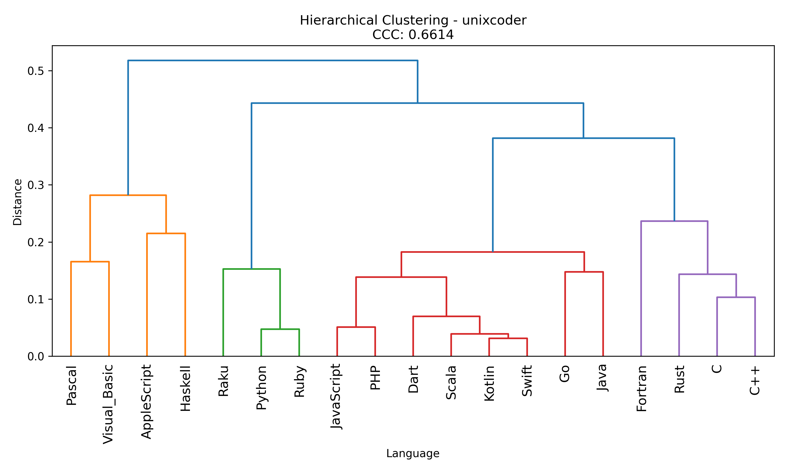
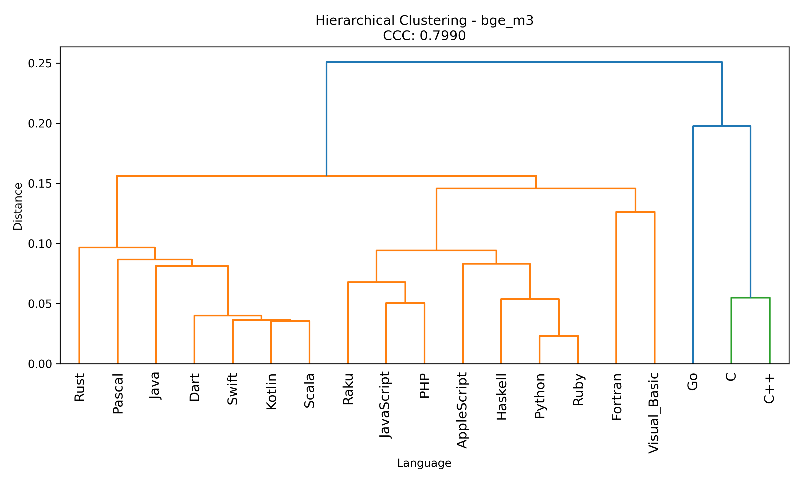

# RQ1: Baseline Language Families and Embedding Model Comparison

**Date:** March 8, 2026

---

## 1. Research Question

**Does the underlying embedding model significantly affect the discovered structures when grouping programming languages into families? Which model best captures the semantic and structural relationships among 19 programming languages?**

While the ultimate goal of RQ1 involves measuring performance degradation across language families after fine-tuning, the crucial **Phase 1: Baseline Establishment** centers on understanding how base embedding models structure the programming language space. We examine how code-specialised versus general-purpose embedding models calculate the semantic distance between languages and group them into coherent families.

## 2. Hypothesis

We hypothesise that the geometric structure of programming languages is heavily dependent on the chosen embedding model's pre-training objective:
- **Code-specialised models** (e.g., UniXCoder) will cluster languages based on structural, syntactical, and paradigmatic similarities since they are explicitly trained to process source code logic.
- **General-purpose models** (e.g., BGE-M3, text-embedding-ada-002) will group languages based on token overlap, variable naming conventions, and surface-level semantics.
- **Models with shared architectures** (e.g., Qwen3 and Octen) will produce highly correlated language family structures.

## 3. Dataset

The dataset consists of embeddings generated for **19 programming languages** that span multiple paradigms (imperative, functional, object-oriented, scripting, systems):

`AppleScript, C, C++, Dart, Fortran, Go, Haskell, Java, JavaScript, Kotlin, PHP, Pascal, Python, Raku, Ruby, Rust, Scala, Swift, Visual_Basic`

## 4. Methodology

### 4.1 Pipeline

1. **Embedding Aggregation (`clustering.py`)**: For each language, we extract feature vectors from individual code snippets and apply mean pooling to represent the language as a singular, aggregated embedding vector.
2. **Hierarchical Clustering**: Pairwise cosine distances between these aggregated language embeddings are calculated. Agglomerative hierarchical clustering (Ward's method) is performed, and the resulting dendrogram is cut to extract 5 distinct language families.
3. **Cophenetic Correlation Coefficient (CCC)**: We evaluate the quality of the hierarchical clustering by calculating the CCC, measuring how faithfully the resulting dendrogram preserves pairwise distances from the original continuous embedding space.
4. **Model Similarity Analysis (`model_distance.py`)**: To compare the models directly, we flatten the cosine distance matrices of all 19 languages from each model and compute the Spearman rank-order correlation between them.

### 4.2 Embedding Models

We evaluated six models spanning a range of parameter sizes and training objectives:

| Model Key   | Full Name                              | Type                             |
| ----------- | -------------------------------------- | -------------------------------- |
| `ada002`    | OpenAI text-embedding-ada-002          | Commercial API                   |
| `bge_m3`    | BAAI/bge-m3                            | Open-source, multilingual        |
| `minilm`    | sentence-transformers/all-MiniLM-L6-v2 | Lightweight sentence transformer |
| `octen`     | Octen/Octen-Embedding-0.6B             | Open-source, 0.6B params         |
| `qwen3`     | Qwen/Qwen3-Embedding-0.6B              | Open-source, 0.6B params         |
| `unixcoder` | microsoft/unixcoder-base               | Code-specialised                 |

---

## 5. Results

### 5.1 Hierarchical Clustering Quality (CCC)

The Cophenetic Correlation Coefficient quantifies how accurately the clustered hierarchy reflects the true high-dimensional distances.

| Rank | Model         | Cophenetic Correlation (CCC) |
| ---- | ------------- | ---------------------------- |
| 1    | **bge_m3**    | 0.7990                       |
| 2    | **qwen3**     | 0.7040                       |
| 3    | **unixcoder** | 0.6614                       |
| 4    | **ada002**    | 0.6328                       |
| 5    | **minilm**    | 0.6289                       |
| 6    | **octen**     | 0.6162                       |

**BGE-M3** produced the most faithful hierarchical representation of the language space (CCC ~0.80), yielding standard well-defined clusters. **UniXCoder** ranks reasonably well (0.66), providing a code-focused tree structure.

### 5.2 Language Families Formed by UniXCoder

Because UniXCoder is the only explicitly code-specialised model, its baseline clusters provide the most structurally relevant language families (Phase 1 Baseline structure):

- **Family 1**: Pascal, Visual_Basic *(Classical/Structured Programming)*
- **Family 2**: AppleScript, Haskell *(Unconventional/Functional Programming)*
- **Family 3**: Python, Raku, Ruby *(Dynamic Scripting)*
- **Family 4**: Dart, Go, Java, JavaScript, Kotlin, PHP, Scala, Swift *(Modern Application/Web/Mobile ecosystems)*
- **Family 5**: C, C++, Fortran, Rust *(Low-level/Systems/HPC)*

### 5.3 Embedding Model Similarity

We quantified the alignment between models using the Spearman correlation of their flattened pairwise language distance matrices.

**Model Similarity (Spearman correlation):**

|           | octen | bge_m3 | unixcoder | qwen3 | minilm | ada002 |
|-----------|-------|--------|-----------|-------|--------|--------|
| **octen** | 1.000 | 0.652  | 0.280     | 0.984 | 0.364  | 0.649  |
| **bge_m3**| 0.652 | 1.000  | 0.547     | 0.597 | 0.331  | 0.619  |
| **unixcoder**|0.280|0.547  | 1.000     | 0.252 | 0.337  | 0.504  |
| **qwen3** | 0.984 | 0.597  | 0.252     | 1.000 | 0.362  | 0.631  |
| **minilm**| 0.364 | 0.331  | 0.337     | 0.362 | 1.000  | 0.237  |
| **ada002**| 0.649 | 0.619  | 0.504     | 0.631 | 0.237  | 1.000  |

**Most similar model pairs:**
1. `octen ↔ qwen3` : **0.984**
2. `octen ↔ bge_m3` : 0.652
3. `octen ↔ ada002` : 0.649
4. `qwen3 ↔ ada002` : 0.631

---

## 6. Discussion

The similarity analysis reveals clear geometric sub-groupings among the embedding models:

1. **Architecture Overpowers Variations**: Octen and Qwen3 exhibit an exceptionally high cross-correlation (0.984), producing nearly identical similarity structures. This is highly expected given their shared foundation (Qwen architectures), demonstrating that base architecture determines the representational space more than slight parameter or training variations.
2. **Retrieval-Oriented Alignment**: BGE-M3 and Ada-002, both heavily optimized for semantic retrieval applications, show moderate agreement with the LLM-derived embeddings (Octen/Qwen3) but sit comfortably in the middle of the pack.
3. **The Code-Specialised Outlier**: UniXCoder exhibits substantially different similarity patterns compared to text-based models. Its correlations with Octen (0.280) and Qwen3 (0.252) are the lowest structural similarities observed barring MiniLM. This divergence implies that UniXCoder organizes programming languages based on deep structural characteristics (ASTs, paradigm boundaries like Systems vs. Scripting) rather than natural language semantic overlap within code tokens.
4. **Lightweight Sentence Transformers**: MiniLM demonstrates the weakest overall agreement with the other models (consistently in the 0.23–0.36 spectrum). As a tiny model optimized purely for natural language sentence similarity, it struggles to encode meaningful cross-language code geometry.

---

## 7. Figures

### Figure 1: Embedding Model Similarity

_Spearman correlation of distance matrices across models. Notice the tight pairing of Octen/Qwen3 and the general divergence of the code-trained UniXCoder._

### Figure 2: Hierarchical Clustering Dendrogram (UniXCoder)

_Hierarchical ward clustering of programming languages by UniXCoder. It distinctively groups core systems languages (C/C++/Rust/Fortran) and isolates dynamic scripting languages (Python/Ruby)._

### Figure 3: Hierarchical Clustering Dendrogram (BGE-M3)

_Language clustering according to BGE-M3, which achieved the highest structural fidelity (CCC). Similar to UniXCoder, it successfully isolates scripting and application languages but makes slight adjustments based on lexical semantics._

---

## 8. Conclusion

As part of Phase 1 Baseline Establishment, we show that the perceived "distance" between distinct language families is remarkably sensitive to the embedding approach. While text-focused LLMs (like Qwen3 and Octen) map language similarity closely together, a code-specialised encoder (UniXCoder) uncovers a distinct geometric representation driven largely by syntactic conventions and execution paradigms. 

Consequently, any cross-family fine-tuning and interference studies (Phase 2 & 3) must account for these baseline differences: interference from migrating a model trained on Java to Python will manifest wildly differently across models simply because their understanding of the semantic distance between those families diverges at the embedding level.
