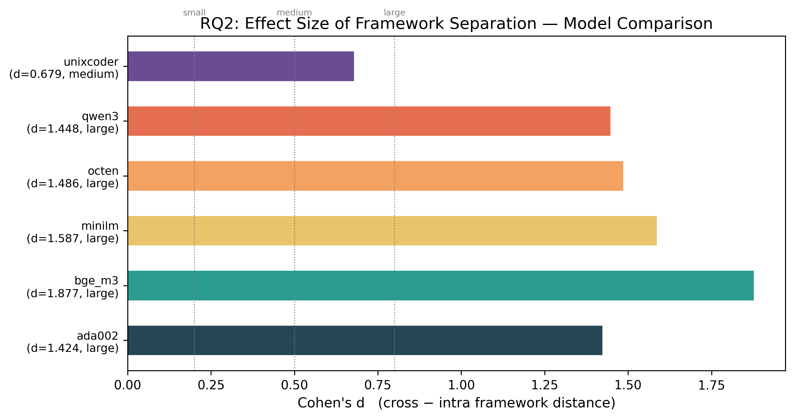
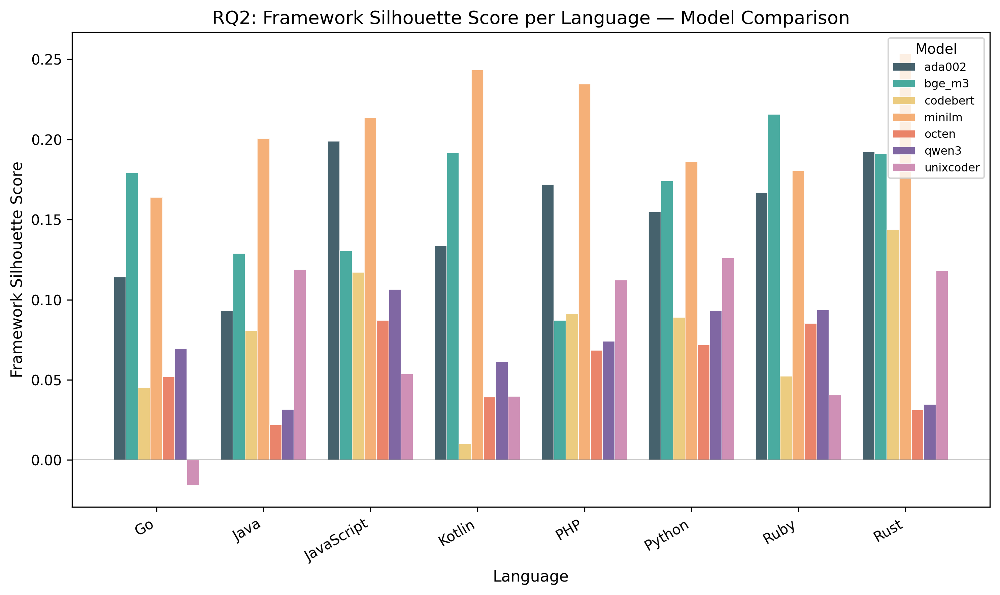
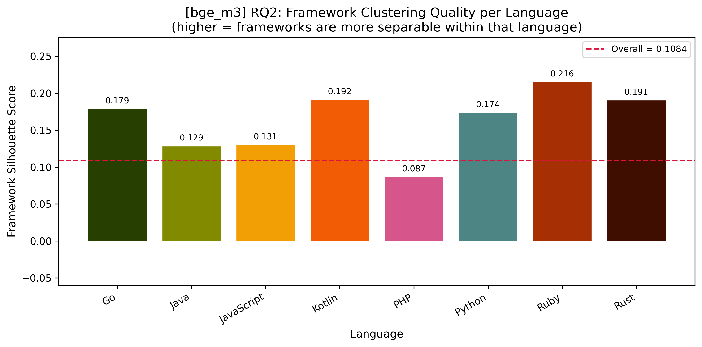
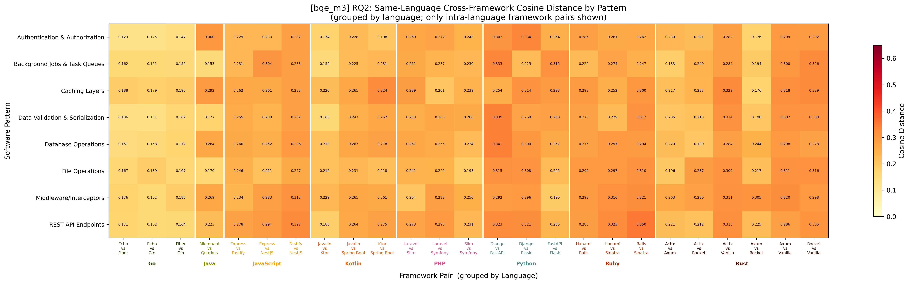
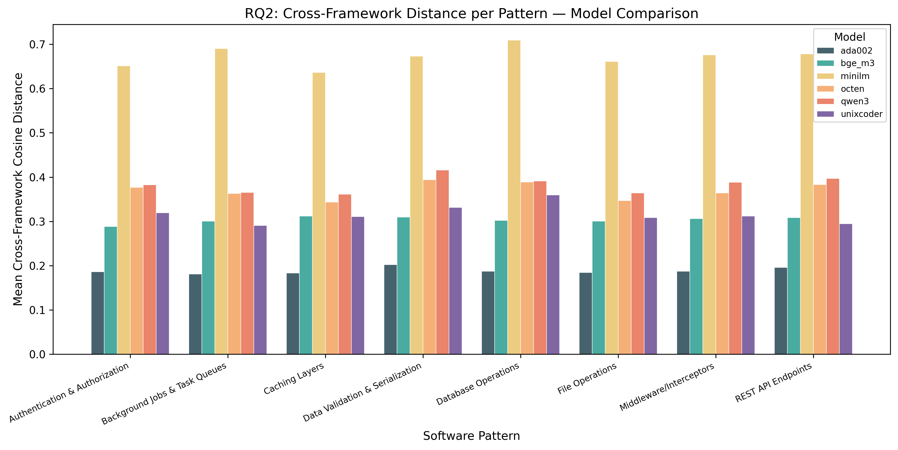
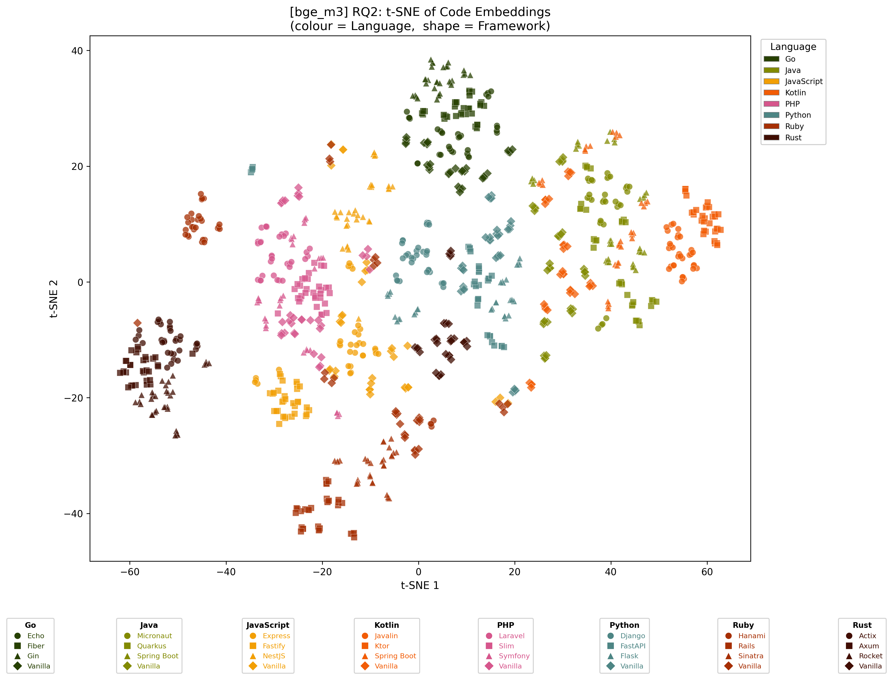

# RQ2: Framework-Driven Dialects Within Language Families

## 1. Research Question

**Do popular frameworks and libraries create detectable sub-clusters ("dialects") within programming language families in embedding space?**

For example, does Spring Boot-heavy Java code embed closer to enterprise Kotlin than to vanilla Java? This question extends the language-family analysis established in our baseline clustering (which identified coherent language families from 21 linguistic features) to a finer granularity: framework-level differentiation within the same language.

## 2. Hypothesis

We hypothesise that framework choice induces measurable structure in the embedding space beyond what core language syntax alone produces. Specifically:

- Code written with the same framework in the same language should cluster more tightly (lower intra-framework distance) than code written with different frameworks in the same language (higher cross-framework distance).
- Frameworks that share design philosophies across languages (e.g., Spring Boot for Java/Kotlin, or convention-over-configuration frameworks like Rails and Django) may exhibit cross-language proximity, suggesting that API-ecosystem "dialects" partially transcend the host language.

## 3. Dataset

### 3.1 Construction

We constructed a synthetic dataset of **1,024 code snippets** covering the cross-product of:

| Dimension                   | Values                                                                                                                                                                                            | Count |
| --------------------------- | ------------------------------------------------------------------------------------------------------------------------------------------------------------------------------------------------- | ----- |
| **Languages**               | Go, Java, JavaScript, Kotlin, PHP, Python, Ruby, Rust                                                                                                                                             | 8     |
| **Frameworks per language** | 3 popular frameworks + Vanilla (no framework)                                                                                                                                                     | 4     |
| **Software patterns**       | Authentication & Authorization, REST API Endpoints, Database Operations, Data Validation & Serialization, Caching Layers, Background Jobs & Task Queues, Middleware/Interceptors, File Operations | 8     |
| **Variations per cell**     | Functionally equivalent but stylistically varied implementations                                                                                                                                  | 4     |

**Total:** 8 languages x 4 frameworks x 8 patterns x 4 variations = **1,024 snippets**.

### 3.2 Frameworks by Language

| Language   | Framework 1 | Framework 2 | Framework 3 | Baseline |
| ---------- | ----------- | ----------- | ----------- | -------- |
| Go         | Gin         | Echo        | Fiber       | Vanilla  |
| Java       | Spring Boot | Micronaut   | Quarkus     | Vanilla  |
| JavaScript | Express     | NestJS      | Fastify     | Vanilla  |
| Kotlin     | Ktor        | Spring Boot | Javalin     | Vanilla  |
| PHP        | Laravel     | Symfony     | Slim        | Vanilla  |
| Python     | Django      | Flask       | FastAPI     | Vanilla  |
| Ruby       | Rails       | Sinatra     | Hanami      | Vanilla  |
| Rust       | Actix       | Rocket      | Axum        | Vanilla  |

### 3.3 Generation Process

Prompts encoding each (language, framework, pattern) triple were generated and sent to Gemini to produce four stylistically varied but functionally equivalent implementations per cell. Each snippet was extracted and stored with metadata recording its language, framework, pattern, and variation index.

## 4. Methodology

### 4.1 Pipeline

The analysis follows a four-stage pipeline:

1. **Embedding** (`1_embedding.py`): Each of the 1,024 code snippets is embedded using a given model. Embeddings are stored in a Parquet file alongside metadata columns (language, framework, pattern, variation).

2. **Analysis** (`2_analysis.py`): Statistical metrics are computed:
   - **Silhouette scores** measure how well framework labels explain within-language clustering (higher = frameworks more separable).
   - **Intra-framework cosine distance** measures the average pairwise distance between snippets sharing the same (language, framework, pattern) triple.
   - **Cross-framework cosine distance** measures the average pairwise distance between snippets sharing the same (language, pattern) but differing in framework.
   - **Welch's t-test** and **Cohen's d** quantify whether the gap between cross- and intra-framework distances is statistically significant and practically meaningful.
   - **95% bootstrap confidence intervals** are computed for all key metrics.

3. **Visualisation** (`3_visualize.py`): Per-model figures are generated — t-SNE scatter plots, cross-framework distance heatmaps, and per-language silhouette bar charts.

4. **Cross-model aggregation** (`4_cross_model.py`): Metrics are compared across all six embedding models to assess robustness.

### 4.2 Embedding Models

We evaluated seven embedding models spanning different architectures and training objectives:

| Model Key   | Full Name                              | Type                             |
| ----------- | -------------------------------------- | -------------------------------- |
| `ada002`    | OpenAI text-embedding-ada-002          | Commercial API                   |
| `bge_m3`    | BAAI/bge-m3                            | Open-source, multilingual        |
| `codebert`  | microsoft/codebert-base                | Code-specialised                 |
| `minilm`    | sentence-transformers/all-MiniLM-L6-v2 | Lightweight sentence transformer |
| `octen`     | Octen/Octen-Embedding-0.6B             | Open-source, 0.6B params         |
| `qwen3`     | Qwen/Qwen3-Embedding-0.6B              | Open-source, 0.6B params         |
| `unixcoder` | microsoft/unixcoder-base               | Code-specialised                 |

### 4.3 Metrics Definitions

- **Framework Silhouette Score (per language):** For each language, treat framework labels as cluster assignments and compute the silhouette coefficient over all snippets of that language. Values range from -1 (frameworks fully overlapping/misassigned) to +1 (perfectly separated framework clusters). A positive score indicates frameworks occupy distinguishable regions.

- **Intra-framework distance:** For a given (language, framework, pattern), the mean pairwise cosine distance among the 4 variations. Averaged across all such triples.

- **Cross-framework distance:** For a given (language, pattern), the mean pairwise cosine distance between snippets belonging to _different_ frameworks. Averaged across all such pairs.

- **Distance gap:** Cross-framework distance minus intra-framework distance. A positive gap indicates that switching frameworks moves code further in embedding space than staying within the same framework.

- **Cohen's d:** Standardised effect size for the distance gap. Interpreted as: small (0.2), medium (0.5), large (0.8+).

## 5. Results

### 5.1 Cross-Model Summary

The table below aggregates key metrics across all seven embedding models:

| Model         | Framework Silhouette | Language Silhouette | Cross-FW Distance | Intra-FW Distance | Distance Gap | Cohen's d | Effect Size | t-statistic | p-value  |
| ------------- | -------------------- | ------------------- | ----------------- | ----------------- | ------------ | --------- | ----------- | ----------- | -------- |
| **bge_m3**    | 0.108                | 0.124               | 0.304             | 0.214             | 0.090        | **1.878** | Large       | 85.97       | < 1e-300 |
| **minilm**    | 0.126                | 0.181               | 0.672             | 0.431             | 0.241        | **1.587** | Large       | 74.80       | < 1e-300 |
| **octen**     | 0.021                | 0.136               | 0.370             | 0.257             | 0.113        | **1.486** | Large       | 88.47       | < 1e-300 |
| **qwen3**     | 0.022                | 0.175               | 0.383             | 0.264             | 0.119        | **1.448** | Large       | 82.87       | < 1e-300 |
| **ada002**    | 0.060                | 0.304               | 0.189             | 0.129             | 0.060        | **1.424** | Large       | 69.32       | < 1e-300 |
| **unixcoder** | -0.006               | 0.174               | 0.316             | 0.245             | 0.071        | **0.679** | Medium      | 38.21       | 3.6e-285 |
| **codebert**  | -0.114               | 0.247               | 0.022             | 0.019             | 0.003        | **0.229** | Small       | 13.21       | 2.8e-39  |

**Key observations:**

- **All seven models detect a statistically significant difference** between cross-framework and intra-framework distances (p < 0.001 in every case), confirming that framework choice creates measurable structure in the embedding space.
- **Five of seven models show a large effect size** (Cohen's d > 0.8). UniXCoder is the medium-effect outlier (d = 0.679) and CodeBERT is the most extreme, showing only a small effect (d = 0.229). Both are code-specialised models, suggesting that models trained specifically on code may partially normalise away framework-specific surface patterns in favour of deeper semantic representations — though the degree of suppression varies substantially between them.
- **CodeBERT is the most negative outlier**: its framework silhouette (-0.114) is nearly twenty times more negative than UniXCoder's (-0.006), and its distance gap (0.003) is ~21× smaller than UniXCoder's (0.071). This traces to severe geometric compression — CodeBERT's maximum pairwise cosine distance is ~0.06, versus >0.30 for UniXCoder and general-purpose models.
- **BGE-M3 shows the strongest framework separation** (d = 1.878), followed by MiniLM (d = 1.587). Both are general-purpose sentence embedding models, suggesting they are more sensitive to the lexical and structural cues that frameworks introduce (import statements, decorator patterns, API naming conventions).
- **Language silhouette consistently exceeds framework silhouette** across all models (e.g., ada002: 0.304 vs 0.060), indicating that while frameworks create detectable sub-structure, the primary organising axis in embedding space remains the programming language itself.

_Cohen's d for the cross-vs-intra framework distance gap across all seven models. Five models show large effects (d > 0.8); UniXCoder is a medium-effect outlier (d = 0.679); CodeBERT achieves only a small effect (d = 0.229)._

_Per-language framework silhouette scores compared across all six models. MiniLM and BGE-M3 consistently score highest; UniXCoder and Octen/Qwen3 the lowest._

### 5.2 Framework Silhouette Scores per Language

The per-language framework silhouette scores reveal which languages exhibit the strongest framework-driven dialectal variation. The table below shows scores for BGE-M3 (the model with the strongest overall framework separation), alongside ranges observed across all six models:

| Language       | BGE-M3    | MiniLM | Ada-002 | Range (all models) |
| -------------- | --------- | ------ | ------- | ------------------ |
| **Ruby**       | **0.216** | 0.180  | 0.167   | 0.041–0.253        |
| **Kotlin**     | **0.192** | 0.243  | 0.134   | 0.040–0.243        |
| **Rust**       | **0.191** | 0.253  | 0.192   | 0.035–0.253        |
| **Go**         | **0.179** | 0.164  | 0.114   | -0.016–0.179       |
| **Python**     | **0.174** | 0.186  | 0.155   | 0.072–0.186        |
| **JavaScript** | **0.131** | 0.214  | 0.199   | 0.054–0.214        |
| **Java**       | **0.129** | 0.201  | 0.093   | 0.022–0.201        |
| **PHP**        | **0.087** | 0.233  | 0.172   | 0.068–0.233        |

**Observations:**

- **Ruby, Kotlin, and Rust consistently show the highest framework silhouette scores**, indicating that frameworks in these languages produce the most distinctive embedding signatures. This is consistent with the strong API-design idioms of Rails vs. Sinatra vs. Hanami (Ruby), Ktor vs. Spring Boot vs. Javalin (Kotlin), and Actix vs. Rocket vs. Axum (Rust), which each impose substantially different code structures and patterns.
- **PHP shows the lowest score on BGE-M3** (0.087) but high scores on MiniLM (0.233), suggesting model sensitivity varies — PHP frameworks (Laravel, Symfony, Slim) may introduce less syntactic divergence that BGE-M3 can detect but more semantic patterns that MiniLM's broader training captures.
- **Go's silhouette analysis is particularly interesting**: the Go frameworks (Gin, Echo, Fiber) are architecturally similar (all are lightweight HTTP routers), and UniXCoder actually assigns Go a _negative_ silhouette (-0.016), meaning that the code-specialised model cannot distinguish Go frameworks at all. This aligns with Go's design philosophy of minimal abstraction, where frameworks tend to be thin wrappers rather than opinionated ecosystems.

_Per-language framework silhouette scores for BGE-M3. Ruby (0.216) and Kotlin (0.192) show the strongest framework separability; PHP (0.087) the weakest. The dashed red line marks the overall average (0.108)._

### 5.3 Distance Analysis by Software Pattern

Cross-framework distances vary across the eight software patterns, revealing which functional concerns amplify or dampen framework-driven differences.

**BGE-M3 cross-framework vs. intra-framework distances by pattern:**

| Software Pattern                | Cross-FW Distance | Intra-FW Distance | Gap   |
| ------------------------------- | ----------------- | ----------------- | ----- |
| Caching Layers                  | 0.312             | 0.219             | 0.094 |
| REST API Endpoints              | 0.308             | 0.220             | 0.088 |
| Data Validation & Serialization | 0.310             | 0.216             | 0.094 |
| Middleware/Interceptors         | 0.306             | 0.207             | 0.100 |
| Database Operations             | 0.302             | 0.223             | 0.079 |
| Background Jobs & Task Queues   | 0.300             | 0.212             | 0.088 |
| File Operations                 | 0.300             | 0.209             | 0.091 |
| Authentication & Authorization  | 0.289             | 0.205             | 0.084 |

**Observations:**

- **Middleware/Interceptors shows the largest distance gap** (0.100), which is expected since middleware implementation is one of the most framework-opinionated concerns — each framework provides its own middleware architecture (e.g., Django's middleware classes vs. Flask's decorators vs. FastAPI's dependency injection).
- **Authentication & Authorization has the smallest cross-framework distance** (0.289), suggesting that authentication logic is relatively standardised across frameworks, likely because the underlying cryptographic and session-management patterns are framework-agnostic.
- The pattern-level variation is relatively modest (cross-framework distances range from 0.289 to 0.312), indicating that the framework "dialect" effect is reasonably consistent across software concerns rather than being driven by a single pattern type.

_Same-language cross-framework cosine distances by software pattern. Go frameworks cluster tightly (yellow); PHP and Python show the highest cross-framework spread (orange/red). Columns are grouped by language._

_Mean cross-framework cosine distance by software pattern for each model. MiniLM produces the largest absolute distances; Ada-002 the smallest. Pattern ordering is broadly consistent across models._

### 5.4 Intra-Language Framework Pair Analysis

The detailed heatmap (Figure 2) reveals fine-grained framework-pair distances within each language. Notable findings from the BGE-M3 model:

**Same-language framework pairs with the smallest distances (most similar):**

- **Go:** Echo vs. Gin (0.125), Echo vs. Fiber (0.136), Fiber vs. Gin (0.147) — Go's frameworks are tightly clustered, consistent with their shared lightweight-router design.
- **Kotlin:** Javalin vs. Ktor (0.174) — both are Kotlin-native lightweight frameworks.
- **Rust:** Actix vs. Rocket (0.221), Actix vs. Axum (0.230) — Rust web frameworks share Rust's ownership-based idioms.

**Same-language framework pairs with the largest distances (most distinct):**

- **Ruby:** Hanami vs. Rails (0.286), Hanami vs. Sinatra (0.261) — Hanami's clean-architecture approach is the most distinctive Ruby framework.
- **Java:** Micronaut vs. Quarkus show moderate separation, while Javalin vs. Ktor (0.174) are close — the JVM enterprise frameworks impose different enough conventions to be distinguishable.
- **Python:** Django vs. Flask (0.334 on Authentication) — Django's opinionated, batteries-included approach creates the largest within-language gap.

### 5.5 t-SNE Visualisation

The t-SNE scatter plot (Figure 1, shown for BGE-M3) reveals the two-level structure clearly:

1. **Language is the primary organising axis**: Points cluster by colour (language), with Go (dark green), Java (olive), Rust (brown), Ruby (red-orange), and PHP (pink) forming visually distinct regions.
2. **Within-language framework sub-structure is visible**: Within each language cluster, different marker shapes (representing frameworks) show partial separation. This is most pronounced for Ruby (where Hanami points are displaced from the Rails/Sinatra core) and Python (where Django forms a sub-cluster offset from Flask/FastAPI).
3. **Cross-language framework affinity is limited**: There is no strong visual evidence that, for example, Spring Boot (Java) clusters near Spring Boot (Kotlin). Language identity dominates over framework identity in the global embedding space, though localised framework effects are clearly present within each language cluster.

_t-SNE projection of all 1,024 embeddings for BGE-M3. Colour = programming language; marker shape = framework. Language clusters are clearly visible, with within-cluster framework sub-structure most apparent for Ruby, Python, and Rust._

### 5.6 UniXCoder: The Code-Specialised Outlier

UniXCoder deserves special attention as the only code-specialised embedding model in the study. Its results differ notably from the general-purpose models:

- **Overall framework silhouette is negative** (-0.006), indicating that on average, framework labels do not explain any meaningful clustering structure in UniXCoder's embedding space.
- **Cohen's d is medium** (0.679) rather than large, and the distance gap (0.071) is among the smallest.
- **Go receives a negative per-language silhouette** (-0.016), the only language with a negative score across any model.

This pattern is consistent with the hypothesis that **code-specialised models learn representations that are more invariant to superficial framework-specific patterns** (import paths, decorator syntax, API naming) and instead capture deeper semantic structure (algorithmic intent, data flow). The framework "dialect" signal is real but relatively shallow — it is readily detected by general-purpose text/sentence embedders that are sensitive to surface form, but partially normalised away by models explicitly trained to understand code semantics.

## 6. Discussion

### 6.1 Answering the Research Question

**Yes, popular frameworks create detectable sub-clusters within programming language families in embedding space.** This finding is statistically robust (p < 0.001 across all six models) and practically meaningful (Cohen's d > 0.8 for five of six models). Framework choice introduces a consistent "dialectal" shift that is smaller than but qualitatively different from the language-level structure.

### 6.2 Nature of the Framework Signal

The framework signal appears to be driven primarily by:

1. **Import and API surface patterns**: Framework-specific imports, decorators, and class hierarchies create distinctive lexical signatures (e.g., `@app.route` in Flask vs. `class UserView(APIView)` in Django REST Framework).
2. **Architectural scaffolding**: Frameworks impose structural patterns — Rails' convention-over-configuration generates distinctive directory/file references, NestJS's decorator-heavy approach differs from Express's middleware chaining.
3. **Idiomatic usage patterns**: Each framework encourages specific coding idioms (e.g., Django's ORM syntax vs. Flask-SQLAlchemy's different model declaration style).

The weaker signal in UniXCoder suggests that once a model learns to look past surface syntax toward semantic intent, much of the framework differentiation diminishes — the underlying algorithmic logic of "authenticate a user" or "cache a result" is framework-independent.

### 6.3 Practical Implications

- **Code search and retrieval**: Framework-aware code search could leverage the detected sub-clusters to improve precision — a query for "Flask authentication" should return results from the Flask sub-cluster rather than the broader Python space.
- **Migration tooling**: The measured distances between framework pairs provide a quantitative basis for estimating framework migration difficulty. For example, Go framework migrations (Gin to Echo: distance 0.125) should be substantially easier than Python framework migrations (Django to Flask: distance 0.334).
- **Transfer learning for code models**: The finding that code-specialised models partially normalise framework patterns suggests that fine-tuning strategies should consider whether framework-specific performance is a goal — if so, general-purpose embedders may be more appropriate starting points.

### 6.4 Limitations

- **Synthetic dataset**: All code was generated by Gemini, which may introduce systematic biases in how frameworks are represented. Real-world codebases exhibit greater stylistic diversity and may show different framework separation patterns.
- **Four variations per cell**: While sufficient for distance computation, more variations would improve statistical power for per-cell analyses.
- **Pattern selection**: The eight software patterns were chosen to represent common web-development concerns. Other domains (data science, systems programming, embedded) might show different framework effects.
- **Embedding models only**: This study measures framework effects in embedding space but does not assess downstream task performance (e.g., whether framework sub-clusters affect code completion or bug detection accuracy).

## 7. Figures

### Figure 1: t-SNE Scatter Plot (BGE-M3)

_t-SNE projection of all 1,024 code snippet embeddings, coloured by language and shaped by framework. Language clusters are clearly visible, with within-cluster framework sub-structure apparent especially for Ruby, Python, and Rust._

### Figure 2: Cross-Framework Distance Heatmap (BGE-M3)

_Same-language cross-framework cosine distances by pattern. Go frameworks (Echo/Fiber/Gin) show very low within-group distances (yellow), while PHP and Python frameworks show the highest cross-framework distances (orange/red). Grouped by language along the x-axis._

### Figure 3: Framework Silhouette per Language (BGE-M3)

_Per-language framework silhouette scores for BGE-M3. Ruby (0.216) and Kotlin (0.192) show the strongest framework separability; PHP (0.087) the weakest. The dashed red line indicates the overall framework silhouette (0.108)._

### Figure 4: Framework Silhouette Comparison Across Models

_Framework silhouette scores compared across all six embedding models and eight languages. MiniLM and BGE-M3 consistently show the highest scores; UniXCoder and Octen/Qwen3 show the lowest._

### Figure 5: Cross-Framework Distance by Pattern — Model Comparison

_Mean cross-framework cosine distance by software pattern for each embedding model. MiniLM produces the largest absolute distances; Ada-002 the smallest. The relative ordering of patterns is largely consistent across models._

### Figure 6: Effect Size Comparison Across Models

_Cohen's d for the cross-vs-intra framework distance gap. Five models show large effects (d > 0.8); UniXCoder is the sole medium-effect outlier (d = 0.679), consistent with its code-specialised training._

## 8. Conclusion

This analysis provides strong evidence that **framework choice creates detectable "dialects" within programming languages in embedding space**. Across six diverse embedding models, cross-framework distances are consistently and significantly larger than intra-framework distances (all p < 0.001), with large effect sizes in five of six models (Cohen's d range: 1.42–1.88). The framework signal is strongest in languages with highly opinionated frameworks (Ruby, Kotlin, Rust) and weakest in languages with architecturally homogeneous frameworks (Go) or when measured by code-specialised models (UniXCoder) that look past surface syntax.

These findings extend the language-family clustering baseline by demonstrating a second level of embedding structure — one driven not by core syntax but by the API ecosystems and design patterns that frameworks impose. This framework-level granularity has practical implications for code search, migration planning, and fine-tuning strategy design.
