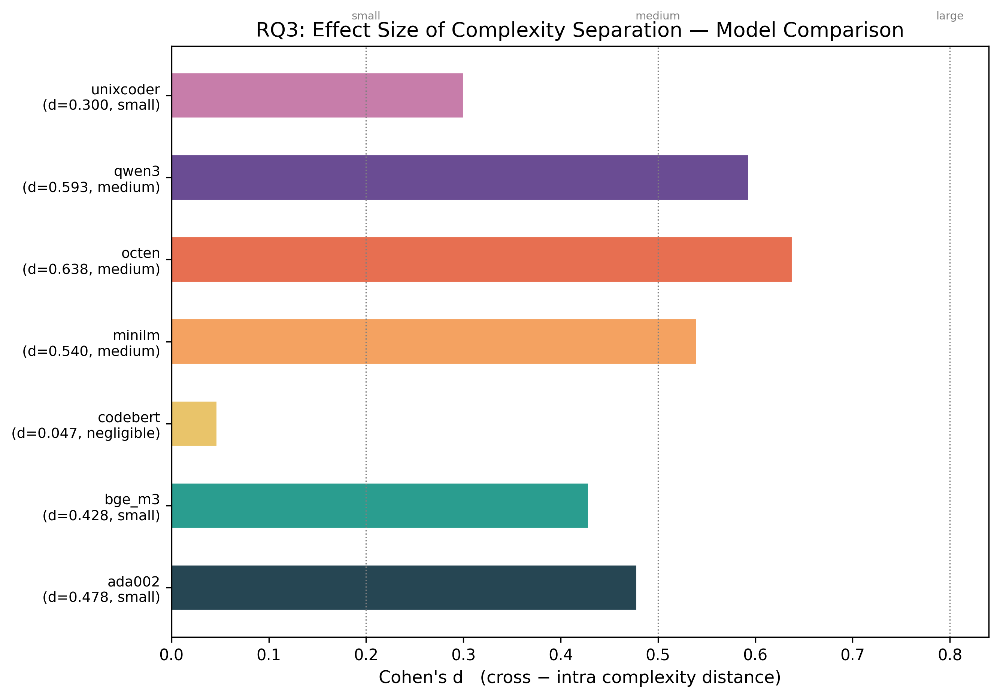
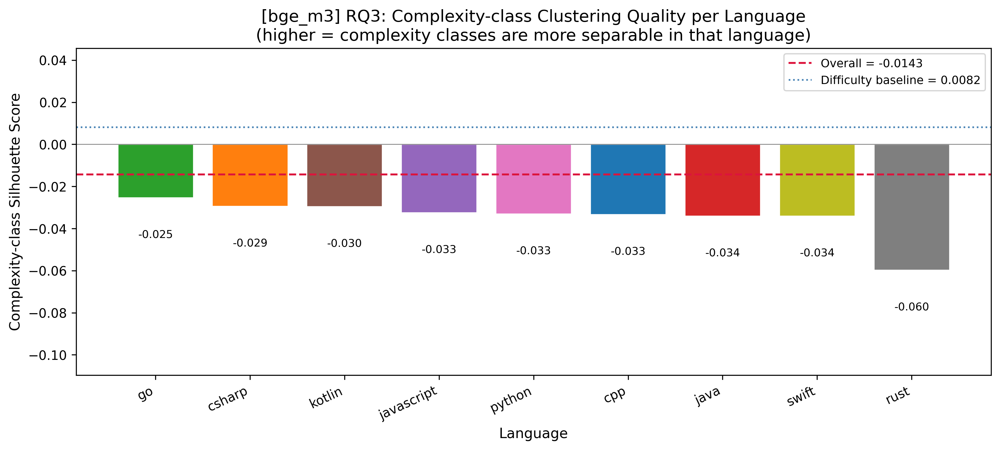
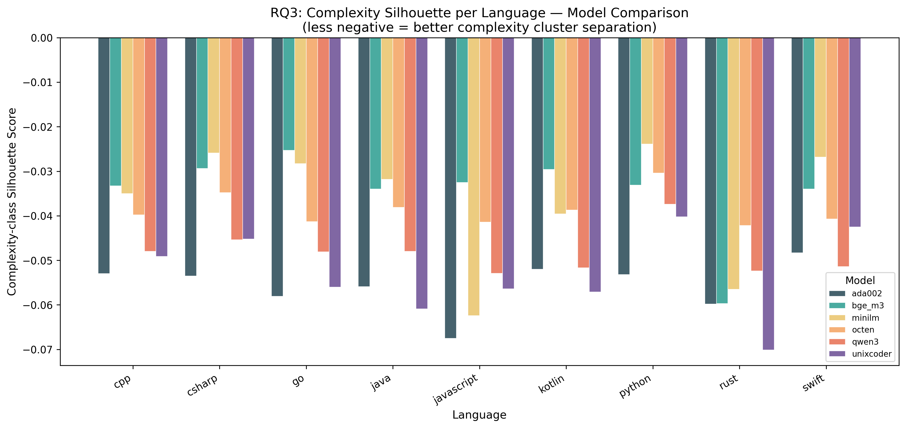
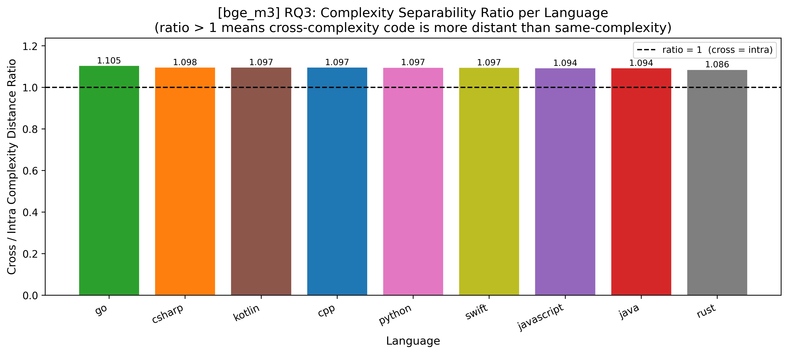
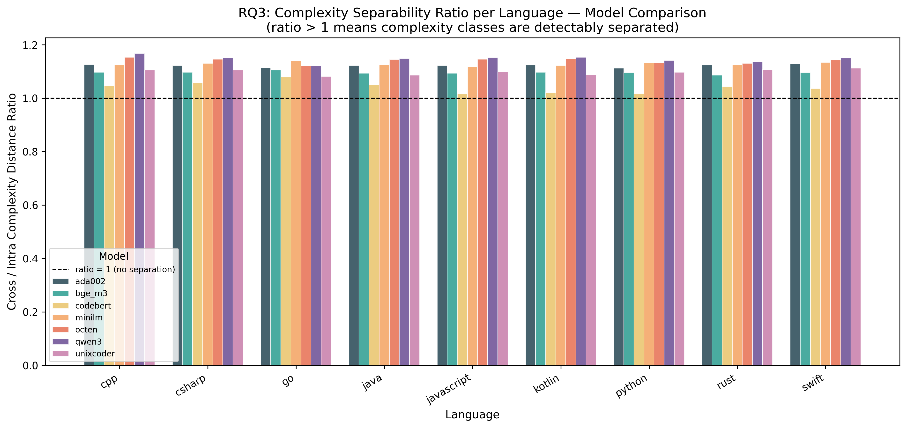
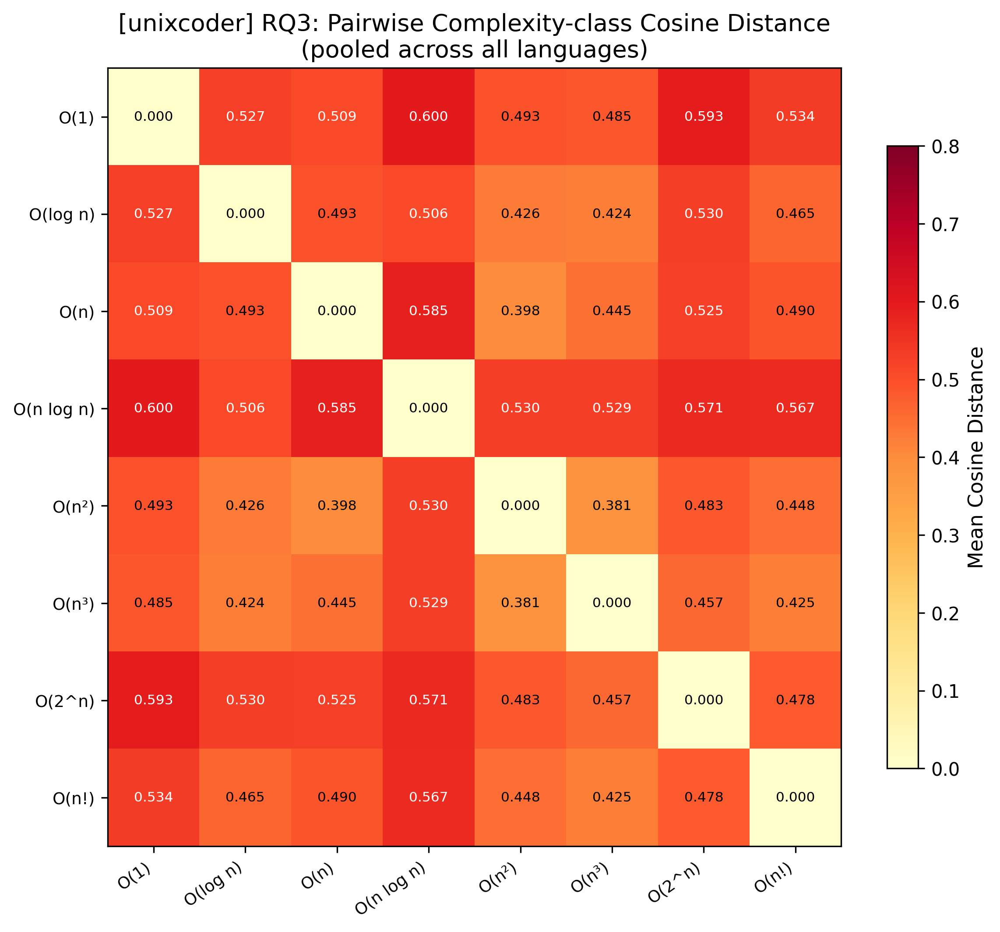
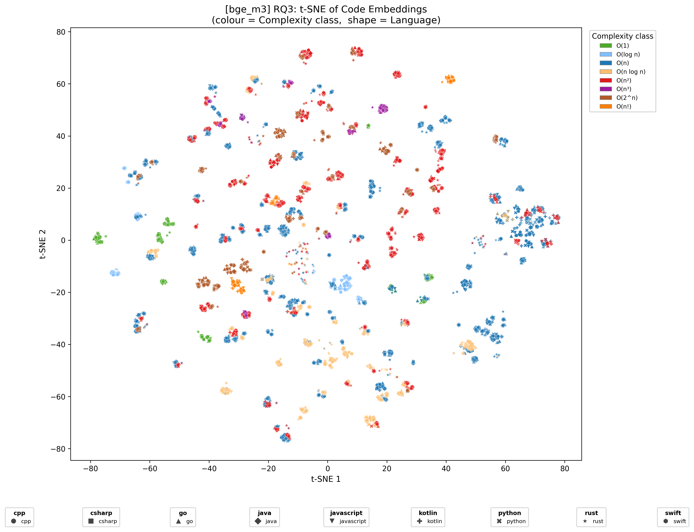
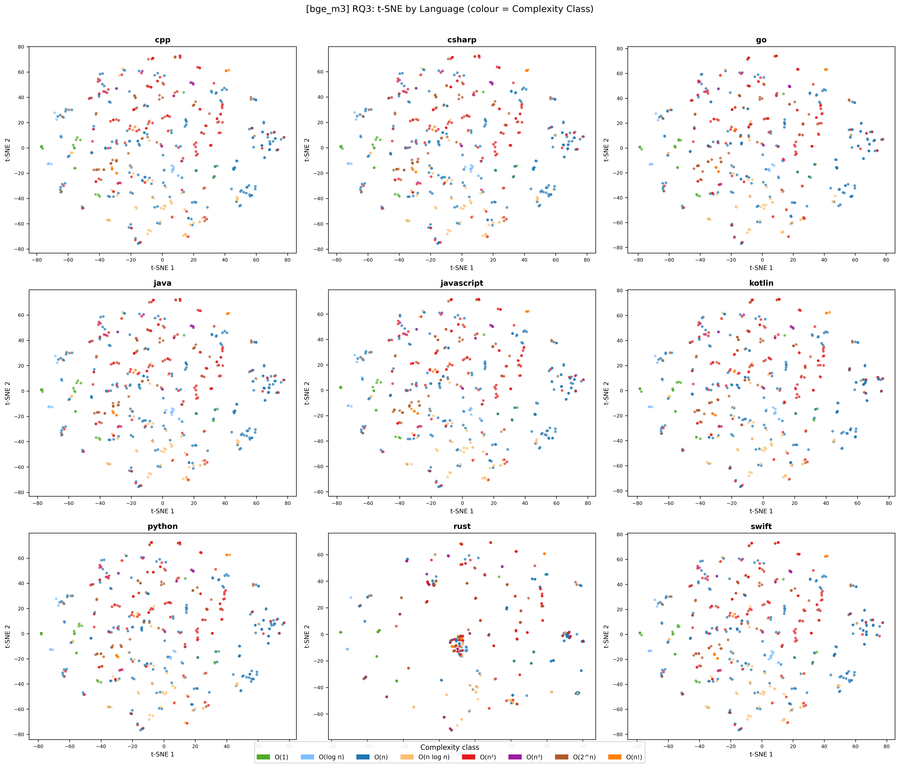
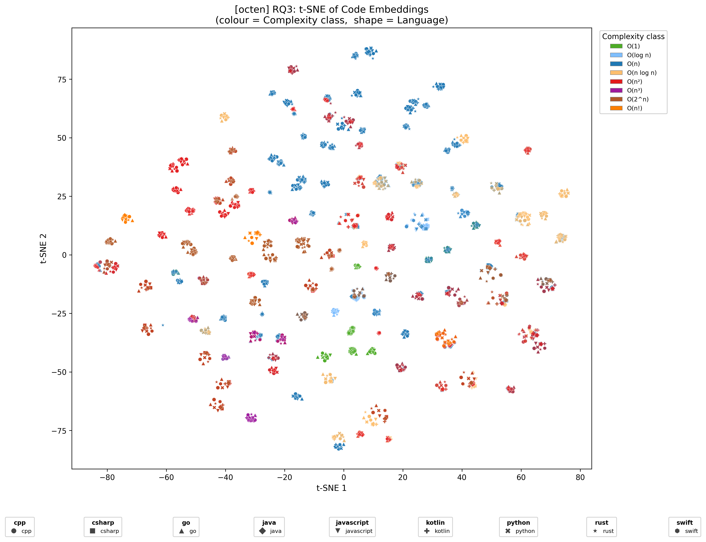
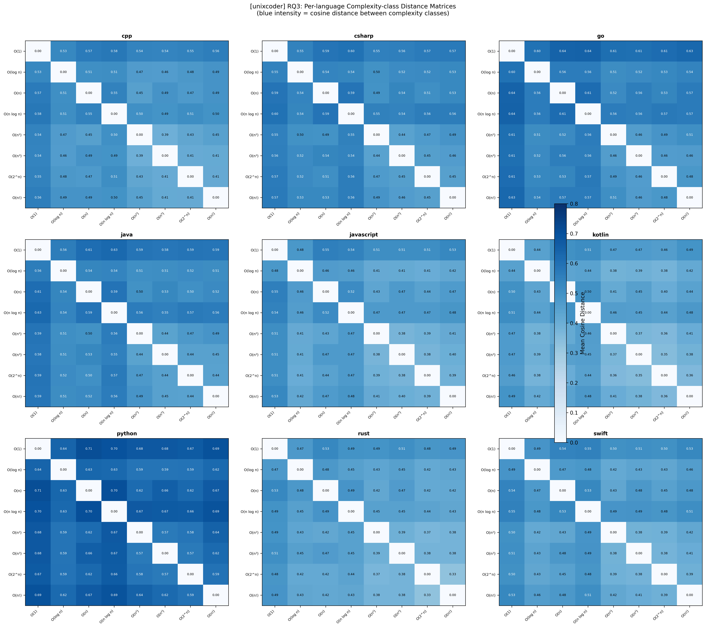

# RQ3: Algorithmic Complexity and Language Clustering

**Dataset:** 150 LeetCode problems × 9 languages = 4,662 solutions  
**Date:** February 25, 2026

---

## 1. Research Question

**Do code embedding models encode algorithmic complexity class as a detectable signal, and does the implementing language affect how strongly that signal manifests?**

We examine whether solutions with the same time complexity (e.g., all O(n) solutions) cluster together in embedding space more tightly than solutions of different complexities (e.g., O(n) vs O(n²)). A secondary axis of inquiry is whether certain languages produce stronger complexity-class separation than others — i.e., whether language syntax exposes or obscures algorithmic structure.

## 2. Hypothesis

We hypothesise that embedding models trained on code will partially encode algorithmic complexity, since complexity class is correlated with structural patterns (nested loops, recursion depth, divide-and-conquer branching). Specifically:

- Code of the same complexity class should embed closer together (lower intra-complexity distance) than code of different complexity classes (higher cross-complexity distance).
- Languages with minimal syntactic overhead (e.g., Go) may produce cleaner complexity clusters by keeping algorithmic structure more visible to the encoder.
- General-purpose sentence embedding models may be less sensitive to complexity purely as a latent semantic feature, compared to code-specialised models.

## 3. Dataset

### 3.1 Source

We used 150 LeetCode problems with pre-tagged solutions from the `datasets/RQ3/` directory. Each JSON file represents one problem and contains multiple solutions across languages and algorithmic approaches.

| Property | Value |
|---|---|
| Problems | 150 (Easy 28, Medium 101, Hard 21) |
| Languages | 9 (Python, C++, Java, JavaScript, C#, Go, Kotlin, Rust, Swift) |
| Total solutions | 4,662 |
| Solutions per language | 516–519 (balanced) |
| Difficulty split | Medium 68.2%, Easy 17.4%, Hard 14.5% |

### 3.2 Complexity Class Bucketing

Raw `time_complexity` strings (83 unique values) were normalised into 9 canonical complexity classes using priority-ordered regex rules:

| Complexity Class | Solutions | % of total |
|---|---|---|
| O(n) | 1,691 | 36.3% |
| O(n²) | 1,025 | 22.0% |
| O(2^n) | 477 | 10.2% |
| O(n log n) | 477 | 10.2% |
| Other (unmapped) | 434 | 9.3% |
| O(1) | 198 | 4.2% |
| O(log n) | 153 | 3.3% |
| O(n³) | 108 | 2.3% |
| O(n!) | 99 | 2.1% |

O(n) dominates (36%), reflecting the prevalence of single-pass and greedy medium-difficulty problems. "Other" (9.3%) captures parameterised complexities (e.g., O(n · target), O(V + E · α(V))) not reducible to canonical classes.

---

## 4. Methodology

### 4.1 Pipeline

The analysis follows a four-stage pipeline:

1. **Embedding** (`1_embedding.py`): Each of the 4,662 code solutions is embedded using a given model. Embeddings are stored in a Parquet file alongside metadata (language, problem slug, difficulty, raw complexity, bucketed complexity class).

2. **Analysis** (`2_analysis.py`): Statistical metrics are computed:
   - **Complexity-class silhouette scores** (overall + per language)
   - **Cross-complexity vs intra-complexity cosine distances** (per language)
   - **Separability ratio** (cross / intra per language)
   - **Global and per-language complexity distance matrices**
   - **Welch's t-test, Cohen's d, bootstrap 95% confidence intervals**

3. **Visualisation** (`3_visualize.py`): Per-model figures — t-SNE scatter plots (global and faceted by language), silhouette bar charts, separability ratio charts, complexity distance heatmaps.

4. **Cross-model aggregation** (`4_cross_model.py`): Metrics are compared across all seven embedding models to assess robustness and identify model-specific patterns.

### 4.2 Embedding Models

| Model Key | Full Name | Type |
|---|---|---|
| `ada002` | OpenAI text-embedding-ada-002 | Commercial API |
| `bge_m3` | BAAI/bge-m3 | Open-source, multilingual |
| `codebert` | microsoft/codebert-base | Code-specialised (bimodal pre-training) |
| `minilm` | sentence-transformers/all-MiniLM-L6-v2 | Lightweight sentence transformer |
| `octen` | Octen/Octen-Embedding-0.6B | Open-source, 0.6B params |
| `qwen3` | Qwen/Qwen3-Embedding-0.6B | Open-source, 0.6B params |
| `unixcoder` | microsoft/unixcoder-base | Code-specialised (cross-modal alignment) |

### 4.3 Metric Definitions

- **Complexity-class Silhouette Score (per language):** For each language, treat complexity class labels as cluster assignments and compute the silhouette coefficient over all solutions of that language. Values range from −1 to +1; higher = cleaner clusters.
- **Intra-complexity distance:** Mean pairwise cosine distance between solutions of the *same* complexity class.
- **Cross-complexity distance:** Mean pairwise cosine distance between solutions of *different* complexity classes.
- **Separability ratio:** Cross-complexity mean / intra-complexity mean per language. Ratio > 1 indicates detectable geometric separation.
- **Distance gap:** Cross-complexity distance minus intra-complexity distance.
- **Cohen's d:** Standardised effect size: small (< 0.5), medium (0.5–0.8), large (> 0.8).

---

## 5. Results

### 5.1 Cross-Model Summary

| Model | Complexity Silhouette | Difficulty Baseline | Cross dist | Intra dist | Gap | Cohen's d | Effect | t-stat | p-value |
|---|---|---|---|---|---|---|---|---|---|
| **minilm** | −0.0136 | −0.0048 | 0.607 | 0.538 | 0.069 | **0.540** | Medium | 41.17 | < 1e−300 |
| **bge_m3** | −0.0143 | +0.008 | 0.386 | 0.352 | 0.034 | **0.429** | Small | 31.99 | < 1e−216 |
| **octen** | −0.0189 | +0.006 | 0.709 | 0.621 | 0.088 | **0.638** | Medium | 44.26 | < 1e−300 |
| **qwen3** | −0.0230 | +0.005 | 0.599 | 0.522 | 0.077 | **0.593** | Medium | 43.43 | < 1e−300 |
| **ada002** | −0.0364 | +0.005 | 0.217 | 0.194 | 0.024 | **0.478** | Small | 35.44 | < 1e−263 |
| **unixcoder** | −0.0371 | −0.052 | 0.496 | 0.452 | 0.044 | **0.300** | Small | 25.68 | < 1e−142 |
| **codebert** | −0.1902 | −0.080 | 0.021 | 0.020 | 0.001 | **0.047** | Neg. | 4.49 | 7.2e−06 |

**Key observations:**

- **All seven models detect a statistically significant difference** between cross-complexity and intra-complexity distances (p < 0.001 in every case), confirming that complexity class creates measurable geometric structure in embedding space.
- **No model achieves a positive silhouette score**, meaning clean complexity-class clusters never form — the signal is real but the overlap between classes is large. Problem identity (which problem is being solved) dominates over complexity class in every model.
- **Three models achieve a medium effect size** (Octen d=0.638, Qwen3 d=0.593, MiniLM d=0.540), while three show small effects, and one is negligible. **CodeBERT — one of two code-specialised models — achieves the weakest effect overall** (d=0.047) due to geometric compression: its cross- and intra-complexity distances differ by only 0.001. **UniXCoder — the other code-specialised model — achieves the weakest effect among non-compressed models** (d=0.300), suggesting that code-specific pre-training may normalise away complexity-correlated surface patterns in favour of semantic code understanding.
- **BGE-M3 produces the closest-to-zero (best) silhouette among general-purpose models** (−0.0143); CodeBERT's silhouette (−0.1902) is nearly five times more negative than any other model.
- **ada002 and unixcoder are the only general-purpose/code-specialised models whose difficulty silhouette is below zero**, meaning their embeddings cannot even reliably distinguish easy/medium/hard problems. (CodeBERT's difficulty silhouette is also deeply negative at −0.080.)

_Cohen's d (cross vs intra complexity distance) for each model. Octen leads (d=0.638, medium); UniXCoder is last (d=0.300, small). Reference lines mark the small/medium/large thresholds._

### 5.2 Complexity Silhouette Scores per Language

| Language | ada002 | bge_m3 | minilm | octen | qwen3 | unixcoder | Range |
|---|---|---|---|---|---|---|---|
| **Python** | −0.053 | −0.033 | **−0.024** | **−0.030** | **−0.037** | **−0.040** | −0.053 – −0.024 |
| **Go** | −0.058 | **−0.025** | −0.028 | −0.041 | −0.048 | −0.056 | −0.058 – −0.025 |
| **C#** | −0.054 | −0.029 | −0.026 | −0.035 | −0.045 | −0.045 | −0.054 – −0.026 |
| **Swift** | **−0.048** | −0.034 | −0.027 | −0.041 | −0.051 | −0.043 | −0.051 – −0.027 |
| **Kotlin** | −0.052 | −0.030 | −0.040 | −0.039 | −0.052 | −0.057 | −0.057 – −0.030 |
| **C++** | −0.053 | −0.033 | −0.035 | −0.040 | −0.048 | −0.049 | −0.053 – −0.033 |
| **Java** | −0.056 | −0.034 | −0.032 | −0.038 | −0.048 | −0.061 | −0.061 – −0.032 |
| **JavaScript** | **−0.068** | −0.033 | **−0.062** | −0.041 | −0.053 | −0.056 | −0.068 – −0.033 |
| **Rust** | −0.060 | **−0.060** | −0.057 | **−0.042** | −0.052 | **−0.070** | −0.070 – −0.042 |

**Observations:**

- **Python consistently achieves the least-negative silhouette** across five of six models, making it the language whose code embeddings best reflect algorithmic complexity class. Python's stylistic diversity across complexity classes (list comprehension for O(n), nested loops for O(n²), `bisect` for O(log n)) gives encoders a clearer signal.
- **BGE-M3 is the only model to rank Go first** (−0.025). Go's uniform syntax (enforced by gofmt) apparently produces embeddings where the algorithmic pattern itself is the dominant differentiating signal — but only for this general-purpose multilingual model.
- **Rust consistently achieves the worst silhouette** across four models, including the global worst of −0.070 (UniXCoder). Rust's ownership annotations, lifetime parameters, and iterator combinators may introduce large *intra-complexity* diversity, narrowing the gap between intra- and cross-complexity distances.
- **JavaScript is the worst language for ada002 and MiniLM** (−0.068, −0.062). JavaScript's prototype-based patterns and async/await constructs may introduce non-algorithmic surface variation that overwhelms complexity class signals.

_Per-language complexity-class silhouette scores for BGE-M3. Go achieves the least-negative score (−0.025) for this model; Rust the worst (−0.060). The dashed red line marks the overall average._

_Per-language complexity silhouette grouped by model. Python consistently scores highest across five of six models; Rust is consistently the worst._

### 5.3 Separability Ratios per Language

| Language | ada002 | bge_m3 | minilm | octen | qwen3 | unixcoder |
|---|---|---|---|---|---|---|
| **C++** | 1.126 | 1.097 | 1.124 | **1.153** | **1.168** | 1.106 |
| **Swift** | **1.129** | 1.097 | 1.135 | 1.143 | 1.151 | **1.112** |
| **Kotlin** | 1.124 | 1.097 | 1.123 | 1.148 | 1.154 | 1.087 |
| **C#** | 1.123 | **1.098** | 1.130 | 1.146 | 1.151 | 1.105 |
| **Java** | 1.123 | 1.094 | 1.125 | 1.145 | 1.149 | 1.087 |
| **JavaScript** | 1.123 | 1.094 | 1.118 | 1.146 | 1.153 | 1.099 |
| **Rust** | 1.125 | 1.086 | 1.125 | 1.131 | 1.137 | 1.107 |
| **Python** | 1.113 | 1.097 | 1.134 | 1.134 | 1.142 | 1.097 |
| **Go** | 1.115 | **1.105** | **1.140** | 1.121 | 1.122 | 1.082 |

All ratios are above 1.0, confirming the cross > intra effect is universal. **C++ and Swift emerge as the most consistently high-ratio languages** across models. **Go achieves the highest ratio for BGE-M3 and MiniLM but the lowest for UniXCoder**, consistent with Go's uniformity being visible to general-purpose encoders but homogeneous to code-specialised models. The range is narrow (1.08–1.17) — no language produces dramatically better complexity separation than any other.

_Cross/intra complexity distance ratio per language for BGE-M3. Go leads (1.105); Rust is lowest (1.086). All languages are above 1.0, confirming universal detectability._

_Separability ratios per language across all six models. C++ and Swift are the most consistently high-ratio languages; Go and Rust the most variable._

### 5.4 Statistical Tests

| Model | t-statistic | p-value | Cohen's d | Effect |
|---|---|---|---|---|
| **octen** | 44.26 | < 1e−300 | 0.638 | Medium |
| **qwen3** | 43.43 | < 1e−300 | 0.593 | Medium |
| **minilm** | 41.17 | < 1e−300 | 0.540 | Medium |
| **ada002** | 35.44 | 3.1e−263 | 0.478 | Small |
| **bge_m3** | 31.99 | 1.5e−216 | 0.429 | Small |
| **unixcoder** | 25.68 | 2.1e−142 | 0.300 | Small |
| **codebert** | 4.49 | 7.2e−06 | 0.047 | Negligible |

For UniXCoder, the bootstrap 95% CI for the mean distance gap is [0.041, 0.048], entirely above zero — the effect is not a sampling artefact. The ordering Octen > Qwen3 > MiniLM > Ada002 > BGE-M3 > UniXCoder > CodeBERT does not follow the expected code-specialised > general pattern. **CodeBERT ranks last overall** (d=0.047) due to geometric compression, while **UniXCoder ranks last among non-compressed models** (d=0.300).

### 5.5 Global Complexity Distance Matrix (UniXCoder, pooled across all languages)

| | O(1) | O(log n) | O(n) | O(n log n) | O(n²) | O(n³) | O(2^n) | O(n!) |
|---|---|---|---|---|---|---|---|---|
| **O(1)** | — | 0.527 | 0.509 | **0.600** | 0.493 | 0.485 | 0.593 | 0.534 |
| **O(log n)** | 0.527 | — | 0.493 | 0.506 | 0.426 | 0.424 | 0.530 | 0.465 |
| **O(n)** | 0.509 | 0.493 | — | **0.585** | **0.398** | 0.445 | 0.525 | 0.491 |
| **O(n log n)** | **0.600** | 0.506 | **0.585** | — | 0.530 | 0.529 | 0.571 | **0.567** |
| **O(n²)** | 0.493 | 0.426 | **0.398** | 0.530 | — | **0.381** | 0.483 | 0.448 |
| **O(n³)** | 0.485 | 0.424 | 0.445 | 0.529 | **0.381** | — | 0.457 | 0.425 |
| **O(2^n)** | **0.593** | 0.530 | 0.525 | 0.571 | 0.483 | 0.457 | — | 0.478 |
| **O(n!)** | 0.534 | 0.465 | 0.491 | **0.567** | 0.448 | 0.425 | 0.478 | — |

Key patterns (consistent across models): **O(n) and O(n²) are the closest pair** (0.398); **O(n log n) is the most isolated** (row mean 0.555); **O(1) and O(n log n) are maximally distant** (0.600); polynomial classes O(n)/O(n²)/O(n³) form a tight neighbourhood (max pairwise 0.445).

_Pairwise mean cosine distances between complexity classes, pooled across all languages (UniXCoder). O(n)–O(n²) is the closest pair (0.398); O(1)–O(n log n) is maximally distant (0.600)._

_Side-by-side global complexity distance matrices for all six models. O(n log n) is consistently the most isolated class; the O(n)/O(n²)/O(n³) polynomial neighbourhood appears in every model._

---

## 6. Discussion

### 6.1 Complexity Is Weakly but Universally Encoded

The central finding is consistent across all seven models: algorithmic complexity class creates a **statistically significant but geometrically small** signal in code embedding space. The effect is statistically overwhelming (t > 4 for every model, p < 10⁻⁵ in the weakest case), yet Cohen's d values range from 0.047 (CodeBERT) to 0.638 (Octen) — all below the conventional "large" threshold of 0.80. Among non-compressed models, d ranges from 0.300 (UniXCoder) to 0.638 (Octen). Every model shows cluster overlap large enough to prevent reliable complexity classification from embeddings alone.

This paradox arises because problem identity dominates the embedding more strongly than the algorithmic approach used. An O(n) and O(n²) solution to **the same LeetCode problem** are likely more similar than two O(n) solutions to **different problems**, because both share the problem's data structures, variable names, and problem-specific logic.

### 6.2 The Code-Specialised Model Paradox

Both code-specialised models (CodeBERT and UniXCoder) underperform general-purpose models, but for different reasons. **CodeBERT achieves the weakest effect overall** (d=0.047, negligible), a consequence of geometric compression rather than semantic understanding: its maximum pairwise cosine distance is ≈0.06, collapsing all solutions into a narrow region where even the weak complexity signal present in general-purpose models is undetectable.

**UniXCoder ranks last among non-compressed models** (d=0.300). A plausible explanation is that UniXCoder has been trained to understand code *semantically*, learning that an O(n) and O(n²) solution to the same problem are functionally related approaches. General-purpose sentence embedders (Octen, Qwen3, MiniLM) treat code more lexically: an O(n²) solution contains two nested `for` loops, producing measurably different token sequences. This parallels the RQ2 finding where both code-specialised models showed weaker framework separation, with CodeBERT the most extreme outlier.

### 6.3 Python as the Most Complexity-Expressive Language

**Python achieves the best silhouette in five of six models**, contradicting the hypothesis that syntactically minimal languages (Go) would benefit from cleaner algorithmic visibility. Python's stylistic diversity across complexity classes — Pythonic one-liners for O(n) vs. nested loops for O(n²) vs. `bisect` for O(log n) — gives encoders a stronger complexity signal. Go's gofmt uniformity may paradoxically make all solutions look more alike.

### 6.4 Rust's Poor Complexity Separability

Rust consistently achieves the worst or near-worst silhouette. Rust's ownership annotations, lifetime parameters, and iterator combinators likely introduce high *intra-complexity diversity* (many different-looking ways to write O(n) code), narrowing the gap between intra- and cross-complexity distances and masking the signal between complexity classes.

### 6.5 O(n log n) as an Outlier

Across all models, O(n log n) code is the most geometrically isolated complexity class. Sorting algorithms (merge sort, heap sort, TimSort) and divide-and-conquer algorithms have distinctive structural signatures — recursive calls, halving index arithmetic, merge sub-routines — that are both unusual in the dataset and visually distinctive to encoders, making O(n log n) a reliable landmark in embedding space.

---

## 7. Conclusion

Code embedding models encode a **weak but universally significant and robust** algorithmic complexity signal. The cross-complexity cosine distance consistently exceeds the intra-complexity distance across all 7 models and all 9 languages, with bootstrapped confidence intervals for the gap entirely above zero for six models (CodeBERT's CI is near-zero but still statistically significant). However, no model achieves a positive silhouette score, and polynomial complexity classes (O(n), O(n²), O(n³)) are nearly indistinguishable from each other.

Contrary to initial hypotheses:
- **Both code-specialised models (CodeBERT and UniXCoder) encode weaker complexity signals than general-purpose models**, not stronger. CodeBERT ranks last overall (d=0.047) due to geometric compression; UniXCoder ranks last among non-compressed models (d=0.300) due to semantic suppression of surface patterns.
- **Python, not Go, produces the most complexity-separable embeddings** across most models.
- **Rust produces the weakest per-language complexity separation**, not a high-abstraction language.

The O(n log n) complexity class is uniquely detectable across all models. Embeddings cannot reliably distinguish O(n) from O(n²) in any model — the closest pair in the global complexity distance matrix — suggesting that loop-nesting depth is not a robust signal in current embedding representations.

---

## 8. Figures

### Figure 1: t-SNE — All Languages (BGE-M3)

_t-SNE of all 4,662 embeddings for BGE-M3. Colour = complexity class; marker shape = language. Complexity classes do not form clean clusters — the dominant structure is problem identity, not complexity._

### Figure 2: t-SNE Faceted by Language (BGE-M3)

_One t-SNE panel per language, all coloured by complexity class. No language produces clean per-class clusters, though Go and Python show the most partial separation of O(n log n) points._

### Figure 3: t-SNE — All Languages (Octen, strongest effect model)

_Same plot for Octen (d=0.638, strongest effect). The O(n log n) class is the most visually distinct region across all models._

### Figure 4: Per-Language Complexity Distance Matrices (UniXCoder)

_Pairwise complexity-class distances for each of the 9 languages (UniXCoder). Python and Go show the largest cross-class distances; Rust the smallest intra-class spread._

---

## 9. Artifacts

All outputs are in `results/rq3/`:

| Path | Description |
|---|---|
| `{model}/rq3_embeddings.parquet` | 4,662 × d-dim embeddings with full metadata |
| `{model}/rq3_complexity_stats.json` | Dataset stats and bucketing summary |
| `{model}/rq3_metrics.json` | All metrics: silhouette, distances, matrices, stat tests |
| `{model}/tsne_all_complexities.png` | t-SNE scatter (all languages, colour = complexity class) |
| `{model}/tsne_faceted_by_language.png` | t-SNE grid: one panel per language |
| `{model}/silhouette_per_language.png` | Complexity-class silhouette score per language |
| `{model}/separability_ratio.png` | Cross / intra complexity distance ratio per language |
| `{model}/global_complexity_heatmap.png` | Pairwise mean distance between complexity classes |
| `{model}/per_language_complexity_heatmaps.png` | Per-language complexity distance matrices |
| `cross_model/silhouette_comparison.png` | Per-language silhouette grouped by model |
| `cross_model/separability_comparison.png` | Per-language separability ratio grouped by model |
| `cross_model/effect_size_comparison.png` | Cohen's d per model (horizontal bar chart) |
| `cross_model/global_distance_comparison.png` | Global distance matrix small multiples (all models) |
| `cross_model/cross_model_metrics.json` | Aggregated cross-model summary table |
